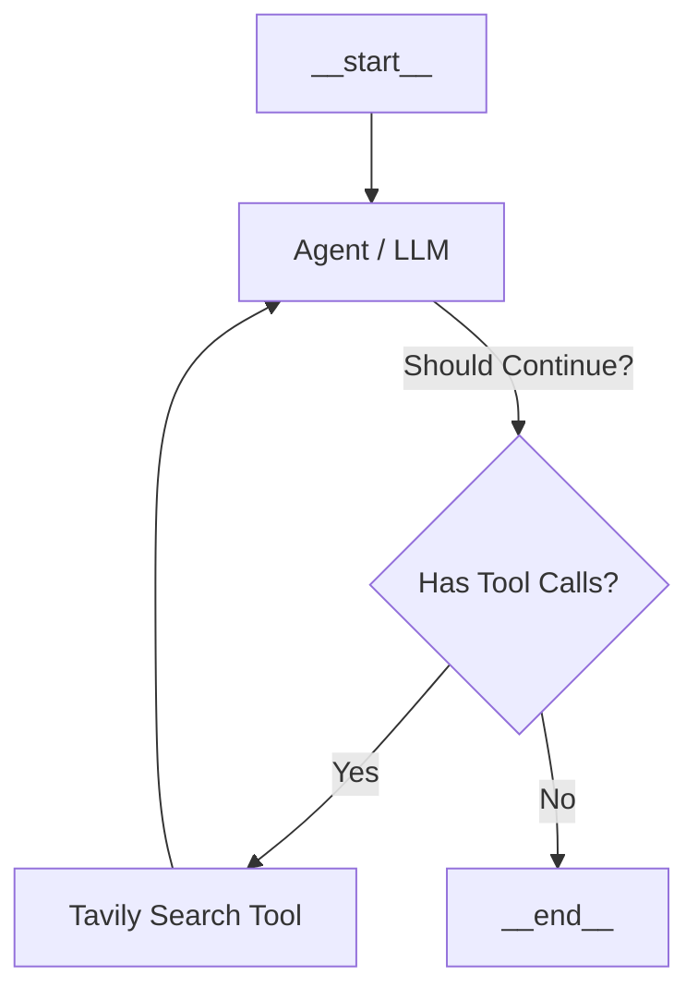

# CLI Chatbot with Web Search & Memory

A lightweight, premium Command-Line Interface (CLI) chatbot powered by **Llama 3.3 (70b-versatile)** on Groq, built using **LangGraph** and **Bun**.

This chatbot features a dynamic agentic workflow that can decide when to search the web for real-time information, maintains persistent conversational memory using a checkpointer, and is optimized for low token consumption.

---

## Features

*   LangGraph Orchestration:** Employs a stateful graph workflow (`StateGraph`) with conditional edges to route between LLM reasoning and tool execution.
*   Tavily Web Search:** Integrated with a custom-wrapped Tavily Search tool that allows the chatbot to search the web for current events and real-time information.
*   Persistent Thread Memory:** Uses `MemorySaver` to persist conversation history across user turns in the CLI session using unique thread IDs.
*   Powered by Bun:** Runs on the ultra-fast Bun JavaScript runtime.

---

## 🛠️ Tech Stack

*   **Runtime:** [Bun](https://bun.sh/)
*   **LLM Orchestration:** [@langchain/langgraph](https://github.com/langchain-ai/langgraphjs) & [@langchain/core](https://github.com/langchain-ai/langchainjs)
*   **LLM Provider:** [ChatGroq](https://github.com/langchain-ai/langchainjs/tree/main/libs/langchain-groq) (Llama-3.3-70b-versatile)
*   **Search Integration:** [Tavily Search](https://tavily.com/)

---

## 🚀 Getting Started

### 📋 Prerequisites

Ensure you have [Bun](https://bun.sh/) installed on your machine.

### ⚙️ Setup & Configuration

1.  **Clone the repository:**
    ```bash
    git clone https://github.com/Rajdeep-Dhar-06/cli-chatbot.git
    cd cli-chatbot
    ```

2.  **Install dependencies:**
    ```bash
    bun install
    ```

3.  **Environment Variables:**
    Create a `.env` file in the root directory and add your API keys:
    ```env
    GROQ_API_KEY=your_groq_api_key
    TAVILY_API_KEY=your_tavily_api_key
    ```

---

## 🎮 Running the Chatbot

Start the interactive CLI session by running:

```bash
bun run index.js
```

### 🗣️ Example Session
```text
You : Who won the latest Formula 1 race?
AI : [Performs Tavily Search] Max Verstappen won the latest Formula 1 race at the Spanish Grand Prix.
You : What is my name?
AI : I don't know your name yet.
You : My name is Rajdeep.
AI : Nice to meet you, Rajdeep.
You : What is my name again?
AI : Your name is Rajdeep.
You : exit
```

---

## 📐 How It Works (Graph Architecture)



1.  **User Input:** The user prompt is injected into the graph state.
2.  **Agent Node:** Evaluates the chat history and decides whether to respond directly or run a search query.
3.  **Conditional Router:** If the LLM generates a tool call, the graph routes the message to the **Tools Node**. Otherwise, it ends.
4.  **Tools Node:** Runs the query on Tavily Search, returns the output, and loops back to the **Agent Node** to synthesize the final answer.
